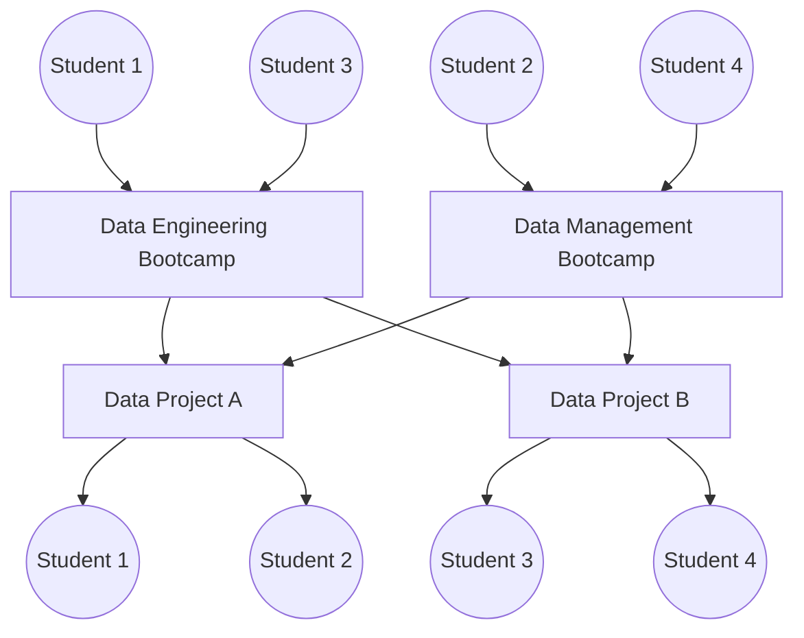

```mermaid
graph TD;
    S1((Student 1)) --> A;
    S2((Student 2)) --> B;
    S5((Student 3)) --> A;
    S6((Student 4)) --> B;
    A[Data Engineering Bootcamp] --> TeamA[Data Project A];
    B[Data Management Bootcamp] --> TeamA;
    A --> TeamB[Data Project B];
    B --> TeamB;
    TeamA --> S3((Student 1));
    TeamA --> S4((Student 2));
    TeamB --> S7((Student 3));
    TeamB --> S8((Student 4));
```
