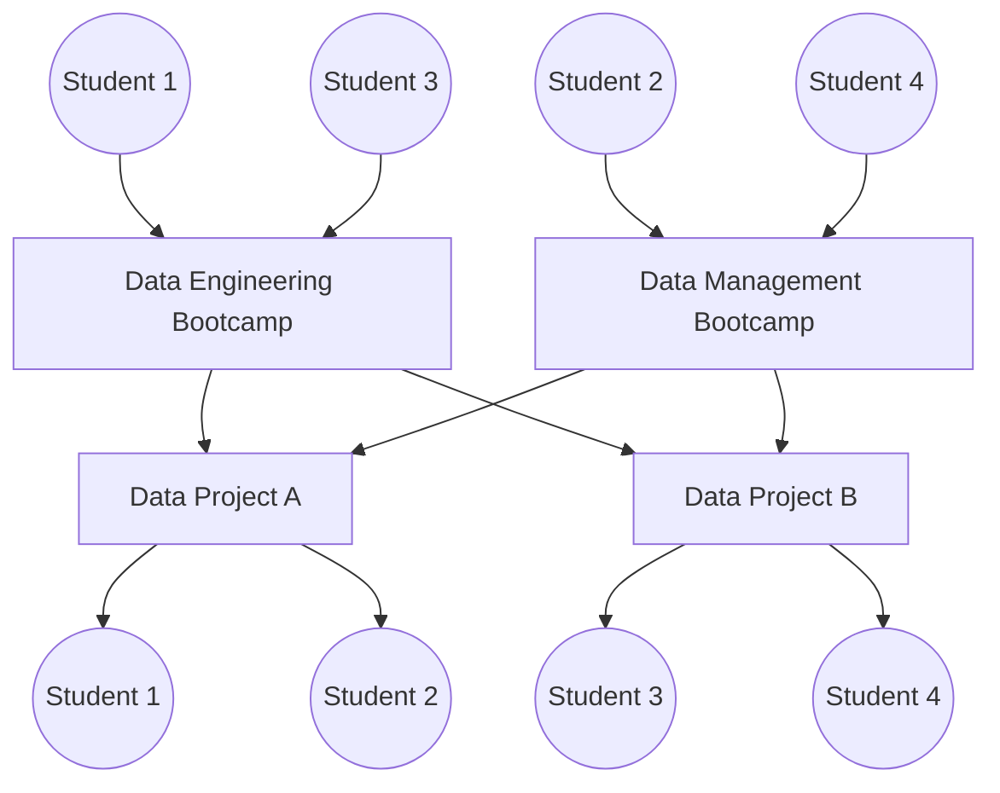
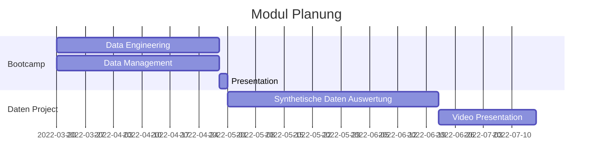

# DataManagement
This is the repository for the Course Data management for computer science master students at the HS Mannheim

```mermaid
graph TD;
    S1((Student 1)) --> A;
    S2((Student 2)) --> B;
    S5((Student 3)) --> A;
    S6((Student 4)) --> B;
    A[Data Engineering Bootcamp] --> TeamA[Data Project A];
    B[Data Management Bootcamp] --> TeamA;
    A --> TeamB[Data Project B];
    B --> TeamB;
    TeamA --> S3((Student 1));
    TeamA --> S4((Student 2));
    TeamB --> S7((Student 3));
    TeamB --> S8((Student 4));
```

```mermaid
gantt
    title Modul Planung
    %% this is a comment
    dateFormat  YYYY-MM-DD
    section Bootcamp
    Data Engineering    :a1, 2022-03-20, 40d
    Data Management     :a2, 2022-03-20 , 40d
    Presentation        :after a1, 2d
    section Daten Project
    Synthetische Daten Auswertung      :2022-05-01  , 52d
    Video Presentation      : 24d
```
